# Nanny Trail Tribe
## Introduction
The purpose of this website is for users to be able to find out more information about the mountain biking club called Nant Y Frith MTB. Users will be able to create a profile where they can store things like their favourite place to ride and what they ride. The website has a page where users can view trails. If they want to get full details of the trails then they can subscribe to a monthly membership where they can view the current trails and an trails that are uploaded. 


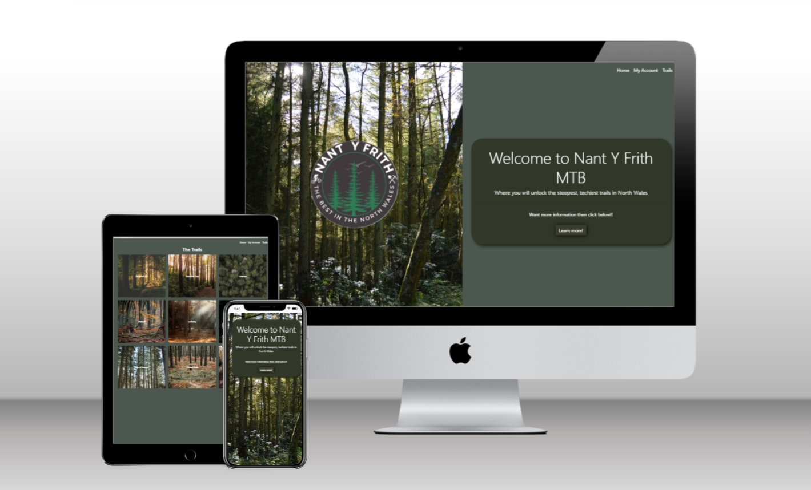

## Features 
* Navigation bar
    * A simple navigation bar is at the top of the page for users to easily go through the website, it also has a dropdown menu. 


* Home page
    * The home page has a simple design with a logo and background image on one side and then some information on the other

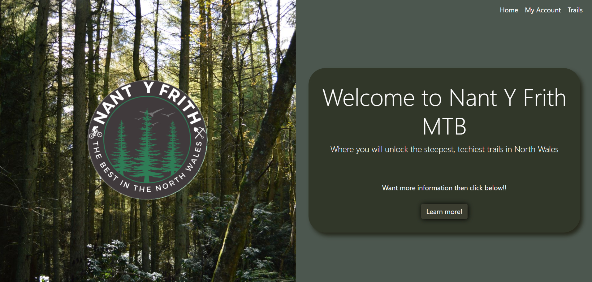

* Login page
    * The login page is a simple form

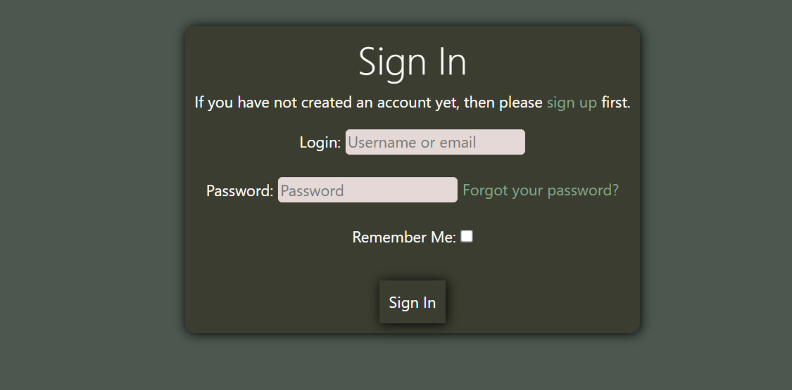

* Logout page
    * The logout page is a simple form similar to the login page

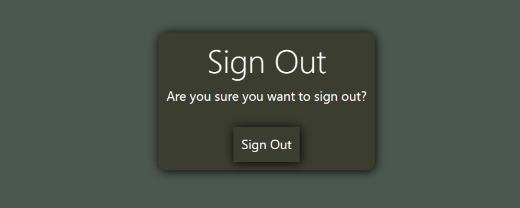

* Register page
    *  The register page is a simple form


* Subscribe Feature
    *  If the user wants to susbscribe they can click on the subscribe button on the trails/profile page, this then takes them to the subscribe page where they can click subscribe to open the stripe payment method.

* Trails Page
    * The main trails page shows all the trails.
    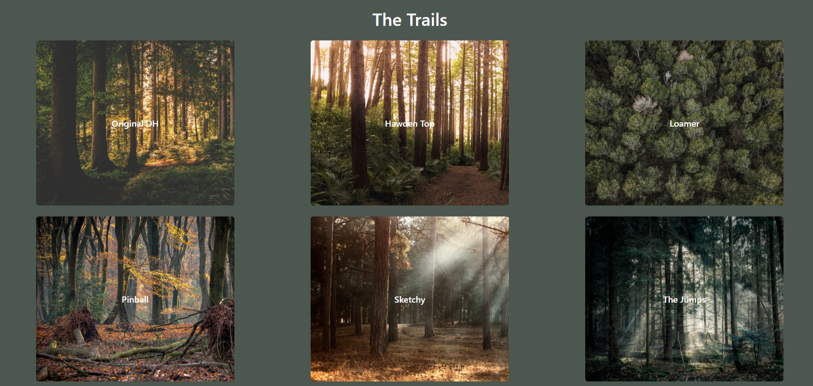

    * From here users can click on a trail. If subscribed it will show the information about the trail.
    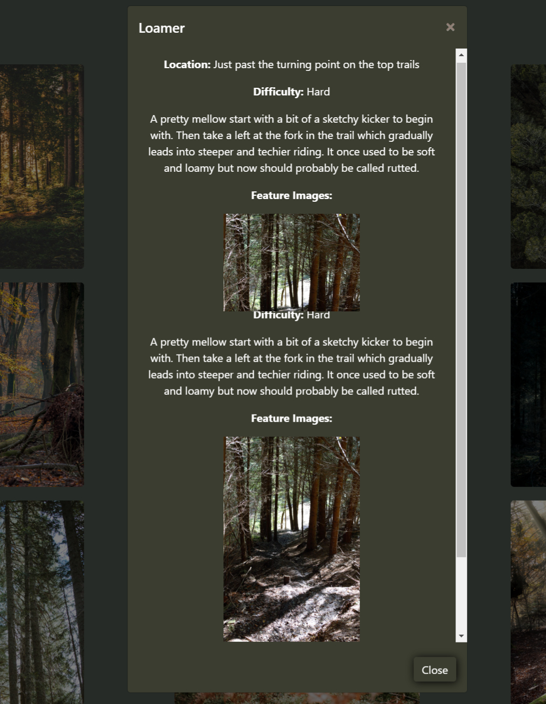

    * If not subscribed then they will be shown this. 
    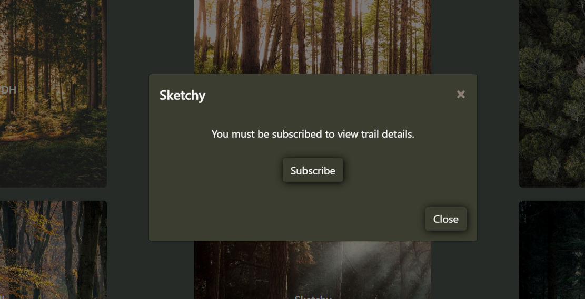

    * If the user is an authenticed admin they will have the options to add trail, edit trail or delete trail. The delete and edit buttons are locted on each individual trail and the add trail is linked with the my account tab. Below is images of the edit trail and add trail forms. Also the simple delete trail page. 
    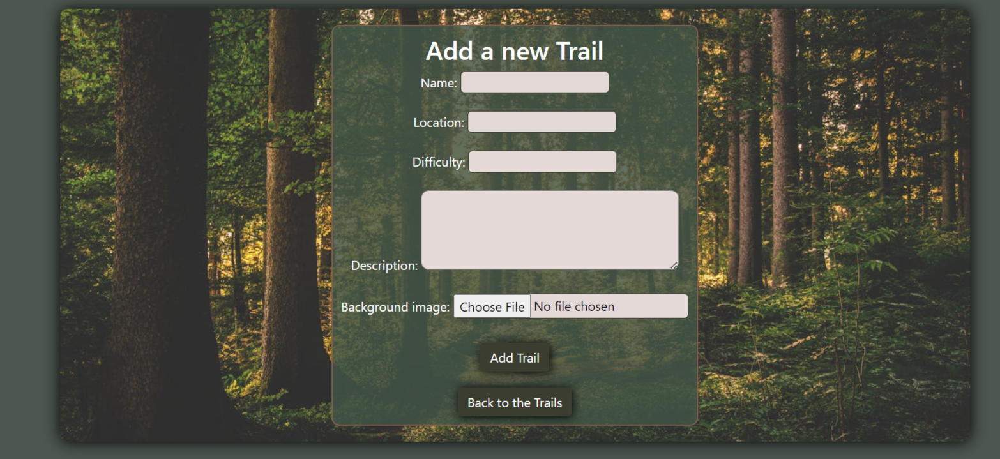
    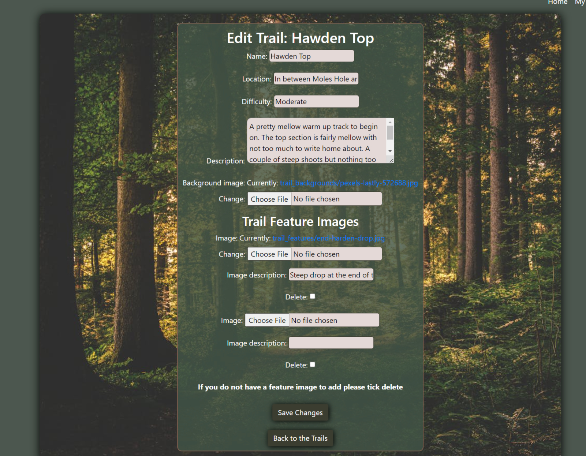
    


* Profile Page
    * The profile page is only accessible if the user has an account and is logged in. It displays user information which can be changed by the user. This information is useful for the website owner.
    * Also displayed on this page is the users subscription status. 
    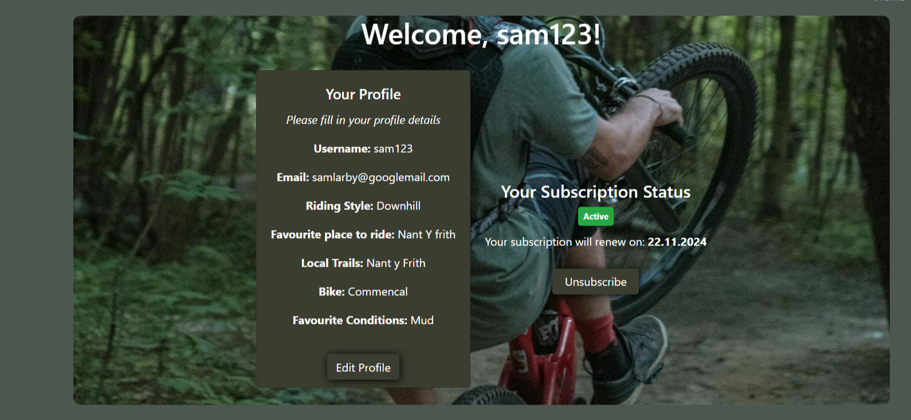
    
    * To change profile information users have to fill in this form. 
    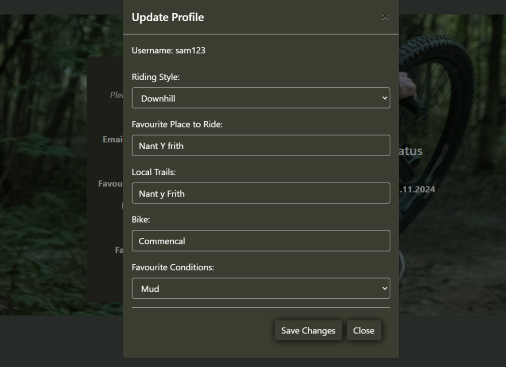


## User Experience
### Website owner
* As the website owner I want to be able to see who registers to the website.
* I want to know what type of riders, where the riders are from and where they like to ride.
* I want to only allow users who have subscribed the chance to view the trails information.
* I want to be able to add new trails and edit old ones.
### First time visitors
* As a first time visitor I want to understand what the website is about.
* I want to learn a bit about the Nant Y Frith location and what it has to offer.
* I should be able to create an account for next time that I come back.
### Second time visitors
* On my second visit I should be able to log into my account and view my profile.
* On viewing my profile it should show my subscription status.
* I should know by now that if I want to learn about trail locations and information I have to subscribe.
* Once subscribed I should be able to view all the trails information. 

### Design Choices
* Colour Scheme
    * The colours used on this page were used as they are forest and natural colours which I believe work well with the theme of the website. 
    
* Typography
    * The font used was Roboto, with sans-serif set as a back up font. Roboto was used as it has an easy readibility and has a clean and modern design.
   
* Imagery
    * The homepage image was taken by myself in the nant y frith woods. All other images used are acknowledged in the acknowledgements section. 

### Wireframes
* All wireframes were created using Balsamiq wireframes, design ideas for the profiles page, home page and trails page are shown here [here](documentation/readme/milestone-project-4.png)

## Database design
* The Nant-Y-Frith database is hosted by Postgresql a relational database.
    * Users - emails and username
    * Users Profiles - username from users, riding style, favourite place to ride, local trails, bike, favourite conditions.
    * Stipe customers - links all stripe information to the user
    * Trails - contains all information about the trails
    * Trail feature images - Contains any feature images and links them to the corresponding trail they were added to


### Testing
#### Functional Testing
* Creating a user
    * This works as it should. A user can be created if the username does not already exist. 
    * The user is asked to verify email, when the email is verified they are then redirected to the homepage.
* Logging in as user 
    * User can log in on the log in page accessed through my accounts tab. 
    * If the username or password was wrong or does not exist the user is shown an incorrect password or username message. 
* Logging out
    * The log out button is clicked and the user is logged out and taken back to the homepage. 
* Add A Trail
    * Only uses who are authenticated can add trails. 
    * If not authenticated the ooption is not there.
    * User clicks on add trail and is taken to add trail page.
    * User fills in all details not leavinng anything blank clicks the add trail.
    * The trail is then added and visible on the trails page.
    * If authenticated user wants to add feature images they will have to do so through the edit trail button. Reasoning for this is explained in bugs. 
* Edit Trail
    * If authenticated when user clicks on a trail they are shown a edit button.
    * On click they are taken to the edit form.
    * If the user chooses to edit details or the image they can
    * If user wants to add feature images they can, but if they do not have any feature images to add they must press delete, reasoning explained in bugs. 
* Delete Trail
    * When clicked the the authenticated user is taken to the delete page and asked if they are sure they want to delete.
    * Also shown a message to say that their review has been deleted. 
* Trails page
    * All trails are visible to all users.
    * If user is not subscribed and they click on a trail they are shown a mus be subscribed message and an ooption to subscribe, this button works.
    * If user is subscribed they see the trail information etc.
    * If any feature images are present with that trail subscribed users can see them and are able to click on them to enlarge them.
* Subscribing 
    * User clicks subscribe on the subscribe page. This takes them to the stripe susbscription page.
    * All details filled in correctly the user is then redirected a a subscription successful page, with a trails link on it. This link works. 
    * Now trail information is visible. Stripe webhook is working.
* Unsubscribe
    * User can unsubscribe from their profile page.
    * Click unsubscribe button this takes them to a page confirming they have unsubscribed. 
* Profile Page
    * Profile page is accessed from my accounts tab.
    * The profile automaically displays email and username.
    * It will display none for othr variables until the user inputs them. 
    * To inout details, click edit profile which brings up a form.
    * Form details filled out click save changes they are then uploaded to the profile. 

* Navbar testing
    * All navbar links take the user to the correct place, on both small and large screens. 
* CRUD testing
    * Testing on the add/edit/delete buttons was done to make sure there was no crossovers effecting each other. All work as intended. 

### Validator testing
* PEP 8 Online
    * This validator Service was used to validate the python file in the project to ensure there were no syntax errors in the project. The results were all clear as shown below. 
    <details>
        <summary>PEP 8</summary>
        
    </details>

The W3C CSS validator and the W3C Markup Validator were used to validate every page of the project to make sure there were no syntax errors.
* [W3C CSS Validator](https://jigsaw.w3.org/css-validator/#validate_by_input) Results showed no errors in any css file.
* [W3C Markup Validator](https://validator.w3.org/) - Results for each page are below
    * [Homepage](documentation/readme/homepage-validation.jpg)
    * [Trails](documentation/readme/trails-validation.jpg)
    * [Add Trail](documentation/readme/add-trail-validation.jpg)
    * [Edit Trail](documentation/readme/edit-trail-validation.jpg)
    * [Delete Trail](documentation/readme/delete-trail-validation.jpg)
    * [Profile](documentation/readme/profile-validation.jpg)
    * [Subscribe](documentation/readme/subscribe-validation.jpg)
    * [Unsubscribe](documentation/readme/unsubscribe-validation.jpg)
* [JSHint](https://jshint.com) [Javascript validation](documentation/readme/js-validation.jpg)


* All webpages were tested using lighthouse and all performed to a passable level for performance, accessability, best practises and SEO for both mobile and desktop screen sizes.

### Testing User Stories

* Web owner user goals
    * As the web owner I want to see who registers for the website.
        * This can be done my accessing the django admin.
    * I want to know what type of riders and where they are coming from
        * When the users fill in their profile information this can be looked at to see the type of people interested in the trails.
    * I want to only allow subscribed users to see the trail information. 
        * This is handled by stripe susbcriptions, only the trail information is shown to subscribed users. 
    * I want to be able to add new trails and edit old ones.
        * This can be done via the add trails and edit trails button, trails can also be deleted. 
* First time visitor goals
    * As a first time visitor I want to understand what the website is about.
        * This can be achieved on the homepage by clicking on the working learn now button.     
    * I want to learn a bit about the Nant Y Frith location and what it has to offer.
        * This is also achievable in the learn now pop up on the home page.
        * Users can also go to the trails page and see the amount of trails available.
    * I should be able to create an account for next time that I come back.
        * Users can create an account through the django allauth authentication system.

* Second time visitor goals
    * On my second visit I should be able to log into my account and view my profile.
        * This works and can be done by clicking on my accounts and pressing login which then takes you to the login page.
        * If enetered credentials match a user in the database then they will log in.
    * On viewing my profile it should show my subscription status.
        * By clicking on profile the subscription status is clearly visible.
    * I should know by now that if I want to learn about trail locations and information I have to subscribe.
        * It is made clear when users click on a trail they must subscribe to get more information.
    * Once subscribed I should be able to view all the trails information. 
        * Once subscribed the users are added to stripe customers and then have the ability to view more details about each trail.

* Future visitor goals
    * A future idea is to actually create a trail map so it makes it a lot easier for first time visitors to find the trails in the woods. 
    
## Bugs Found
### Deployment bug to heroku loading static files 
* A bug found whilst deploying to heroku was that the static files werent loading. To fix this I changed the django to django 4.2. Also on my AWS I removed the getobjects from action I the bucket policy. I got the information to do this in a slack forum. 
### Ongoing bug
* A current ongoing bug is linked with the feature images, if the user does not click delete and the trail feature form is empty when they save it will push an empty trail image feature which causes the trails app to crash. 

## Deployment 
### **Heroku**

This application was built using the Gitpod IDE and deployed via Heroku. Follow these instructions to recreate the deployment process:

**1. Prepare the required files**

In the terminal in your code editor, type:

```
pip3 freeze --local > requirements.txt
```

and then...

```
echo web: python app.py > Procfile
```

These commands create two new files in your root directory which Heroku needs to run the application. Ensure Procfile includes a capital P and there is no file extension. Please check your Procfile and remove the last blank line if there is one, to avoid problems when trying to run your app.

**2. Create the app**

- Go to [Heroku](https://heroku.com/) and login to your account.
- Click 'New' and then 'Create new app'.
- Choose an app name and the region closest to you.

**3. Linking to GitHub**

- Within the deployment method, click 'GitHub'
- With your GitHub profile selected, type in your repo name and then search.
- Once found, click connect.

**4. Environment variables**

- Click on 'Settings' and then 'Reveal Config Vars'.
- Add the required key/value variables from your env.py file.


| Key            | Value              |
|----------------| -------------------|  
| `AWS_ACCESS_KEY_ID` | user's own value |
| `AWS_SECRET_ACCESS_KEY` | user's own value |
| `DATABASE_URL` | user's own value |
| `DISABLE_COLLECTSTATIC` | 1 (*this is temporary, and can be removed for the final deployment*) |
| `EMAIL_HOST_PASS` | user's own value |
| `EMAIL_HOST_USER` | user's own value |
| `SECRET_KEY` | user's own value |
| `STRIPE_PUBLIC_KEY` | user's own value |
| `STRIPE_SECRET_KEY` | user's own value |
| `STRIPE_WH_SECRET` | user's own value |
| `USE_AWS` | True |

Values with * are your own values to be created.

**5. Deployment**

- Ensure your two files in step 1 are pushed to GitHub.
- Within the 'Deploy' tab of your Heroku app, click 'Enable Automatic Deploys'
- Just below this, click 'Deploy Branch'.
- Within a few minutes, Heroku should confirm your app has been deployed with a button to view it online.   

   
## Credits
### Image Credits
* Pictures on the trails page are from https://www.freepik.com/ and the attribute is Wirestock, also
https://www.pexels.com with attributes lum3n, Oleksandr P, Lukas Hartmann, Photo by Tyler Lastovich, Anastasia Shuraeva
### Resources used

### Acknowledgements
* I would like to thank my mentor Okwudiri Okoro for their support.
* Also thank you to the slack community. 
* Icons were taken from <https://fontawesome.com/>
* Font was from <https://fonts.google.com/>

* To help with the set up of the stripe susbscriptions function i used this website https://testdriven.io/blog/django-stripe-subscriptions/#fetch-subscription-data

* Creating the allauth accounts verification and the base.html main template I used the boutique_ado walk through.